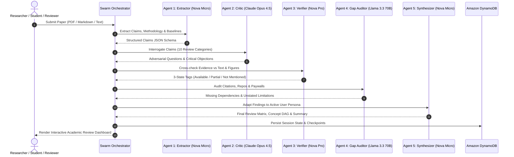
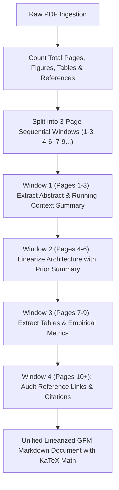

<div align="center">

# The Agentic Research Reviewer
### Adversarial, Claim-by-Claim Scientific Literature Audit Engine on AWS

[](https://builder.aws.com/content/3JbOASHLuR8ohVqh1xEoM7GlIGp/building-the-agentic-research-reviewer-an-adversarial-multi-agent-swarm-on-amazon-bedrock-and-aws-fargate)
[](https://aws.amazon.com/bedrock/)
[](https://aws.amazon.com/textract/)
[](https://aws.amazon.com/s3/)
[](https://aws.amazon.com/dynamodb/)
[](https://aws.amazon.com/ecs/)
[](https://www.typescriptlang.org/)
[](https://react.dev/)
[](https://tailwindcss.com/)
[](./LICENSE)

<p align="center">
  <b>An autonomous multi-agent peer-review swarm that deconstructs research papers, stress-tests empirical claims, audits missing datasets, and adapts scientific comprehension across eight academic personas.</b>
</p>

<p align="center">
  <a href="#-the-crisis-in-scientific-comprehension"><b>Core Motivation</b></a> •
  <a href="#-system-architecture"><b>Architecture</b></a> •
  <a href="#-the-5-agent-swarm-pipeline"><b>Swarm Pipeline</b></a> •
  <a href="#-3-page-windowed-idp--structural-intelligence"><b>Windowed IDP</b></a> •
  <a href="#-comparison-stanford-paperreviewai-vs-the-agentic-research-reviewer"><b>Stanford Comparison</b></a> •
  <a href="#-8-role-adaptive-personas"><b>8 Personas</b></a> •
  <a href="#-getting-started"><b>Quickstart</b></a> •
  <a href="./docs/AWS_SETUP_GUIDE.md"><b>AWS Setup Guide</b></a> •
  <a href="./docs/PROMPT_PLAYBOOK.md"><b>Prompt Playbook</b></a> •
  <a href="./docs/SYSTEM_DESIGN.md"><b>System Design</b></a> •
  <a href="./docs/API_DESIGN.md"><b>API Matrix</b></a>
</p>

</div>

---

## 📖 The Crisis in Scientific Comprehension

Academic literature tools often treat reading as a passive summarization exercise. In practice, modern science is fraught with unstated assumptions, unreleased datasets, fragile baselines, and cherry-picked benchmarks. 

The accounts below illustrate why the research world needs adversarial verification rather than agreeable chatbots:

---

### Machine Learning: Chasing Fragile Benchmarks into Dead Ends
Aarav, a graduate student in Computer Science, was racing against a conference submission deadline when he discovered an arXiv preprint claiming a *"40% latency reduction in attention mechanisms with zero accuracy loss."* Seeking to accelerate his literature review, he fed the 18-page PDF to a standard commercial AI assistant.

The generic AI acted as an agreeable yes-man, producing a glowing summary of the authors' claimed breakthrough. Aarav spent two months attempting to reproduce the method, only to discover that the 40% speedup only held for synthetic sequences of length $L < 64$ at batch size 1. Appendix Table C—which the standard chatbot ignored—showed that memory consumption exploded and accuracy collapsed on real benchmarks. The **Adversarial Critic** automatically interrogates operational boundary conditions ($L > 64$, batch variance) and generates explicit IF-THEN validity checklists before code is written.

---

### Genomics & CRISPR: Midnight Peer Review and the Missing Accession Void
Dr. Priya, an associate professor in genomics, reviews multiple 30-page gene-editing manuscripts every weekend. Her responsibility is to verify whether claimed *in vivo* editing efficiencies are genuinely backed by empirical control groups.

Hunting through multi-column layout tables, supplemental notes, and external repositories consumes 10+ hours per manuscript. Traditional search engines show millions of citations across other papers, but zero tools audit a specific paper's internal data sufficiency. Worse, when raw sequencing datasets are locked behind dead links or missing accessions, standard AI models hallucinate citations rather than admitting the data is absent. The **Evidence Verifier** enforces strict 3-state tagging (`Available`, `Partially Available`, `Not Mentioned`) and the **Gap Investigator** flags missing datasets without hallucinating.

---

### Biotech Startups: The Exploding Cloud Bill and Vision Token Bloat
Elena leads a drug discovery startup analyzing hundreds of preprints monthly. When her engineering team built an internal reader using raw multimodal vision LLMs, their cloud infrastructure costs spiraled: every 25-page paper cost $1.85 to process because the model treated every page as a 1,200-token high-resolution image, even when 90% of the document was plain text.

High recurring cloud bills threatened their runway. Furthermore, uploading proprietary pre-publication drug candidate data to third-party public aggregators violated compliance and created severe intellectual property risks. By combining **AWS Textract Intelligent Document Processing (IDP)** with **Conditional Vision Routing**, processing costs drop to **$0.058 per paper (~95% savings)**, operating entirely inside a secure AWS Virtual Private Cloud (VPC) under IAM roles.

---

### Physics & Quantum Materials: Demystifying Dense Mathematical Formulations
Rohan, a materials science researcher, was reading seminal physics literature on electric field effects in graphene. He found himself overwhelmed by dense mathematical derivations, Fermi energy integrals, and tensor equations across split columns.

Standard chatbot summaries either oversimplified into meaningless pop-science analogies or dumped impenetrable C2 academic jargon without explaining the underlying physical mechanics or intuitive concept dependencies. The **Adaptive Communicator** renders full **KaTeX mathematical equations** alongside an **interactive DAG Concept Map**, adjusting conceptual scaffolding specifically for intuitive physical understanding.

---

### Investigative Journalism: Disentangling Press Release PR from Effect Sizes
Maya, an investigative science journalist, was reporting on a controversial preprint claiming that a newly synthesized dietary compound reduced cardiovascular risk by 50%.

Academic press releases and promotional abstracts often highlight relative risk reductions while concealing absolute risk numbers, tiny sample sizes ($N < 20$), and self-reported recall biases. Standard AI tools uncritically regurgitate the abstract's promotional tone. The **Adversarial Critic** executes an **Anti-Hype & Overclaiming Audit**, isolating absolute vs. relative effect sizes and flagging surrogate endpoint substitutions.

---

### Empirical Economics: Spotting Recall Bias in Natural Experiments
Marcus, an applied econometrician, was designing an independent replication of a famous Difference-in-Differences (DiD) minimum wage study.

He needed to immediately know whether the original study tested pre-treatment parallel trends, whether it used employer telephone surveys vs. state unemployment administrative records, and if hours reductions were captured alongside headcounts. The **Baseline Parity & Replicability Engine** checks natural experiment designs and suggests targeted Google Scholar replication queries.

---

### Embedded Robotics: When SOTA Accuracy Collapses on Edge SRAM
Kenji, an embedded systems engineer, was deploying real-time vision transformers onto resource-constrained edge microcontrollers for autonomous drones.

Academic preprints frequently report theoretical top-1 accuracy without mentioning peak SRAM memory spikes, non-standard CUDA kernels, or severe degradation under 8-bit integer quantization (INT8). The **Decision Matrix** generates explicit hardware boundary conditions (e.g., *IF memory bandwidth $< 50\text{ GB/s}$, THEN frame throughput degrades by 60%*).

---

### Clinical Oncology: Auditing Buried Protocol Alterations and Adverse Events
Dr. Aris evaluates off-label oncology therapies proposed for hospital clinical protocols based on newly published clinical trial manuscripts.

Trial publications sometimes omit dropout attrition rates, change secondary trial endpoints post-hoc, or bury treatment-related adverse events in unindexed appendices. The **Gap Investigator** cross-references stated protocols with reported cohort tables, highlighting unstated patient dropouts and missing control group details.

---

### University Pedagogy: Moving from Rote Reading to Scientific Debate
Prof. Linda teaches a university seminar where students must learn to critically dissect foundational scientific literature rather than passively memorize claims.

Students lean heavily on automated summaries that encourage superficial reading, failing to develop the critical peer-review instincts needed for independent research. The **Socratic Peer Reviewer Chat Widget** engages students in multi-turn scientific debates, asking probing counter-questions rather than giving direct passive answers.

---

### Technology Transfer: Validating Prior Art and Novelty Boundaries for Patents
David conducts prior-art clearance and novelty validation for a university patent application based on an engineering breakthrough.

Determining where prior art ends and where the inventor's genuinely novel, non-obvious claim begins requires separating known baseline techniques from novel contributions. The **Structural Extractor** isolates claimed advances from baseline citations, and the **50-Point Audit Engine** checks component necessity and ablation sufficiency.

---

### Undergraduate Engineering: The Capstone Trap of Unreleased Weights
Ananya was selecting a baseline machine learning architecture for her final-year undergraduate engineering capstone. She evaluated five competing preprints on GitHub claiming state-of-the-art accuracy.

Three of the papers had never released their model weights or dataset splits, and two relied on proprietary compute clusters inaccessible to a student budget. Traditional chatbots summarized all five as equally viable solutions without checking open-source artifact availability. The **Gap Investigator** audits code commit links and data availability statements, instantly flagging which papers provide working open-source artifacts vs unverified claims.

---

### First-Time Paper Readers: Overcoming Matrix Calculus and Notation Anxiety
Dev, a second-year undergraduate, was reading his very first conference paper. He was paralyzed by pages of dense Greek notations, matrix calculus, and loss function formulations.

Generic LLM explainers either produce walls of plain text that scramble the equations or replace the math with childish analogies that fail to teach him how the math connects to the algorithm. The platform renders crisp **KaTeX LaTeX mathematical notation** alongside interactive **DAG Concept Nodes**, allowing Dev to click individual formulas and inspect their exact physical dependencies.

---

### Wet-Lab Biology: Translating Biostatistical Jargon into Biological Mechanics
Zoya, a molecular biology student, was reviewing an ecological genetics study. Her coursework focused on wet-lab techniques, leaving her struggling with complex biostatistical terminology (Bonferroni corrections, ANOVA F-statistics, and statistical power).

When she asked basic chatbots for help, they responded with circular statistical jargon without explaining whether the authors' sample size ($N$) was actually statistically powered to support their conclusions. The **Role-Adaptive Persona Engine** translates statistical rigor criteria into intuitive, domain-appropriate language while explicitly auditing whether sample size $N$ meets power thresholds.

---

### Graduate Defense: Surviving the Committee Methodology Inquisition
Vikram was two weeks away from defending his graduate dissertation. He knew his thesis committee would aggressively cross-examine his methodology and ask why he chose specific baselines over newer alternatives.

Practicing with friends or reading summaries did not prepare him for harsh adversarial questions about baseline parity, control groups, and confounding variables. The **50-Point Adversarial Question Inventory** and **Socratic Chat Widget** act as an automated thesis committee, drilling Vikram with probing counter-arguments and methodological objections.

---

### Regional Universities: Navigating Paywalled Appendices Without Fake Citations
Meera was studying at a regional college that could not afford multi-million dollar subscriptions to closed-access journal databases. She was trying to replicate an experiment whose main data parameters were buried in a paywalled appendix.

Generic AI tools hallucinate answers when data is missing, leading Meera to believe the paper was complete when critical parameters were actually inaccessible. The system explicitly flags paywalls and missing appendices with **"Not Mentioned / Missing Gap"** markers, providing a dedicated dropzone where Meera can upload open-access supplementary notes to recalculate transparency scores.

---

### Cross-Disciplinary Transitions: Bridging Control Theory and Reinforcement Learning
Kabir, a mechanical engineering student, was transitioning into autonomous robotics and reinforcement learning. He understood physical dynamics (PID controllers, torque, kinematics) but was confused by modern RL terms (PPO, Bellman equations, actor-critic).

Papers in the new field assumed graduate-level prior knowledge in machine learning, creating an intimidating wall of unfamiliar jargon. The **Role-Adaptive Communicator** bridges the gap by translating RL terminology into intuitive mechanical and physical analogies, allowing smooth cross-disciplinary onboarding.

---

### Open-Source Builders: Recovering Omitted Hyperparameters and Warmup Schedules
Siddharth was building an open-source library reproduction of a popular deep learning paper for his portfolio to apply for competitive internships.

The authors omitted critical training details: learning rate warmup schedules, weight decay values, and random seed initializations were nowhere to be found in the main text. The **Structural Extractor** automatically extracts all reported training parameters and explicitly lists the **Missing Hyperparameters** needed for reproducible implementation.

---

### Doctoral Admissions: Finding Genuine Research Frontiers for PhD Proposals
Pooja was drafting her Statement of Purpose (SOP) and research proposal for international PhD programs in biomedical engineering. She needed to identify genuine open research gaps in current literature.

Generic summaries only told her what had already been done, making it difficult to formulate a compelling, original research hypothesis. The **Gap Investigator** explicitly extracts **Unstated Limitations** and **Unresolved Gaps**, giving Pooja concrete, high-impact research frontiers to propose in her applications.

---

### Independent Developers: Decontaminating Social Media Benchmark Leaderboards
Aditya, a self-taught software developer building LLM applications, followed machine learning trends on social media. Every week, viral posts claimed a new model "beats commercial foundation models."

Social media hype frequently misrepresents benchmark scores achieved on contaminated training sets or non-standard prompt formats. The **Anti-Hype Interrogation Engine** audits benchmark parity, training data contamination risks, and baseline fairness, cutting through marketing claims with empirical rigor.

---

### Medical Internships: Rapid Clinical Trial Appraisal for Morning Rounds
Neha, a medical intern, was preparing morning clinical case presentations for senior attending physicians during hospital rounds. She needed to rapidly appraise a newly published randomized controlled trial (RCT) on drug dosage.

Rushing through a 30-page medical paper at 5:00 AM left her vulnerable to missing trial exclusion criteria, surrogate outcome substitutions, or industry funding biases. The **Claim vs. Evidence Matrix** compiles a structured 5-point verification checklist with audited verdicts and boundary conditions in under 60 seconds.

---

## 🏛️ System Architecture

The system is architected as an event-driven serverless multi-agent pipeline on **Amazon Web Services (AWS)** using **Amazon Bedrock**, **AWS Textract**, **Amazon S3**, and **Amazon DynamoDB**.

```text
[ User / Client Browser (React 19, KaTeX, Tailwind v4) ]
                           │ (HTTPS PDF Upload / Paste)
                           ▼
          [ Amazon S3 Storage Bucket ]
           /raw-pdf | /markdown | /figures
                           │
                           ▼
    [ Intelligent Document Processing (IDP) Engine ]
      ├── AWS Textract (Multi-column layout & table parsing)
      ├── Local pdf-parse Normalizer (Resilient Fallback)
      └── Conditional Multimodal Figure Cropper
                           │
                           ▼
    [ Amazon Bedrock Multi-Agent Swarm (Converse API) ]
      ├── Agent 1: Structural Extractor    [Amazon Nova Micro  — $0.035/1M]
      ├── Agent 2: Adversarial Critic      [Claude Opus 4.5    — $5.00/1M]
      ├── Agent 3: Evidence Verifier       [Amazon Nova Pro    — $0.80/1M]
      ├── Agent 4: Gap Investigator       [Meta Llama 3.3 70B — $0.72/1M]
      └── Agent 5: Adaptive Communicator   [Amazon Nova Micro  — $0.035/1M]
                           │
                           ▼
          [ Amazon DynamoDB Session State ]
          (Table: PaperReviewerSessions)
                           │
                           ▼
[ Interactive Peer-Review Dashboard & Socratic Chat Assistant ]
```

---

## 🤖 The 5-Agent Swarm Pipeline



| Agent | Model Endpoint | Core Function in the Swarm |
| :--- | :--- | :--- |
| **Agent 1: Structural Extractor** | `amazon.nova-micro-v1:0` | Deconstructs linearized Markdown into structured schemas containing core problem statements, claimed breakthroughs, empirical baselines, and datasets. |
| **Agent 2: Adversarial Critic** | `anthropic.claude-opus-4-5-20251101-v1:0` | Interrogates claims against a 50-point scientific question framework (evaluating statistical power $N$, baseline parity, confounders, and overclaiming). |
| **Agent 3: Evidence Verifier** | `amazon.nova-pro-v1:0` | Cross-checks objections against paper text and figures. Enforces strict 3-state tagging: `Available`, `Partially Available`, or `Not Mentioned`. |
| **Agent 4: Gap Investigator** | `meta.llama3-3-70b-instruct-v1:0` | Scans reference lists, data availability statements, and code repositories to flag paywalled data, unreleased repositories, or unstated limitations. |
| **Agent 5: Adaptive Communicator** | `amazon.nova-micro-v1:0` | Transforms findings into concept graphs, decision matrices, and reading-level summaries tailored to 8 academic personas. |

---

## 📑 3-Page Windowed IDP & Structural Intelligence

Rather than dumping monolithic 30-page PDFs into an unstructured prompt, the Intelligent Document Processing (IDP) engine uses a **3-page rolling context window pipeline**:



### Document Structural Extraction Metrics
1. **Metadata Pre-Extraction:** Counts total pages, figure captions, numerical tables, reference citations, and section headers before invoking agent swarms.
2. **Context Chaining:** Each 3-page window receives the running summary of prior sections, preserving mathematical notation ($...$, $$...$$) and cross-page table integrity.
3. **Citation Grounding:** Cross-checks all reference URLs, DOIs, arXiv IDs, and GitHub repository links against extracted claims.

---

## 🏛️ Comparison: Stanford PaperReview.ai vs. The Agentic Research Reviewer

| Architectural Dimension | **Stanford’s `PaperReview.ai`** (Stanford ML Group) | **The Agentic Research Reviewer** (Pure AWS Stack) |
| :--- | :--- | :--- |
| **Core Paradigm** | **Simulated Conference Referee** (Predicts ICLR-style review text & acceptance score) | **Adversarial Scientific Audit Swarm** (Stress-tests empirical claims, boundary limits & missing code) |
| **Processing Pipeline** | **Asynchronous Email Queue** (Minutes to hours delay) | **Synchronous / Live Real-Time Stream** directly in the browser |
| **Document Scope** | **Hard 15-Page Limit** (Truncates pages 16+ including extended proofs and appendices) | **Full-Document 3-Page Windowed IDP** (Chained rolling context windows across all pages) |
| **Model Architecture** | Monolithic LLM + Tavily Search API + Linear Regression Scoring | **5-Agent Multi-Model Swarm** (`Nova Micro` $\rightarrow$ `Claude Opus 4.5` $\rightarrow$ `Nova Pro` $\rightarrow$ `Llama 3.3 70B`) |
| **Output Structure** | Static text review (Summary, Strengths, Weaknesses, Score) | **Claim Decision Matrix**, $\text{IF-THEN}$ Boundary Cards, 50-Point Question Inventory, & System Mindmaps |
| **Cognitive Personas** | **1 Static Lens** (Standard ML Conference Reviewer) | **8 Dynamic Academic Personas** (PhD, Graduate Scholar, Undergrad, Reviewer, Educator, Practitioner, etc.) |
| **Interactive Visuals** | ❌ None (Static Markdown text output) | ✅ **Live KaTeX Math, Mermaid DAG Flowcharts, 4-Pillar Mindmaps with Zoom/Pan, & Embedded PDF Viewer** |
| **Disciplinary Coverage** | Primarily AI / Computer Science (Grounded strictly in arXiv) | **Multi-Disciplinary** (AI/NLP, Medicine/Gene Editing, Economics/Policy, Physics/Materials Science) |

---

## 🎯 8 Role-Adaptive Personas

```text
┌────────────────────────────────────────────────────────────────────────────────────────┐
│ 1. PhD Candidate / Researcher  │ 5. Science Communicator / Journalist                  │
│ 2. Graduate Scholar / Student  │ 6. Academic Educator / Professor                      │
│ 3. Undergraduate Learner       │ 7. Industry R&D Practitioner                          │
│ 4. Journal Peer Reviewer       │ 8. Independent Replicator / Skeptic                   │
└────────────────────────────────────────────────────────────────────────────────────────┘
```

---

## 🚀 Getting Started

> 📖 **Need help enabling AWS services or Bedrock models?** Follow the step-by-step [**AWS Setup & Model Provisioning Guide (`docs/AWS_SETUP_GUIDE.md`)**](./docs/AWS_SETUP_GUIDE.md) to enable Nova, submit Anthropic Claude consent forms, create S3/DynamoDB resources, and generate IAM access keys.

### Prerequisites
- **Node.js 20+**
- **AWS Account** with Bedrock model access enabled in your configured AWS Region (Amazon Nova, Anthropic Claude, Meta Llama).

### 1. Clone & Install
```bash
git clone https://github.com/your-username/paper-understanding-helper.git
cd paper-understanding-helper
npm install
```

### 2. Configure AWS Environment
```bash
cp .env.example .env
```

Configure your `.env` credentials:
```env
AWS_REGION="YOUR_AWS_REGION"
AWS_ACCESS_KEY_ID="YOUR_AWS_ACCESS_KEY_ID"
AWS_SECRET_ACCESS_KEY="YOUR_AWS_SECRET_ACCESS_KEY"
S3_BUCKET_NAME="paper-reviewer-storage"
DYNAMODB_TABLE_NAME="PaperReviewerSessions"
```

### 3. Start Development Server
```bash
npm run dev
```
Open **[http://localhost:3000](http://localhost:3000)** in your browser.

### 4. Optional: Run with Docker Compose
```bash
# Build and start containerized application
docker compose up --build
```

---

## 🧪 Comprehensive Verification Suites

```bash
# 1. Live AWS Services Diagnostic (S3, DynamoDB, IDP, Bedrock)
npm run test:aws

# 2. Decoupled REST Micro-Task API Test Suite (14/14 Endpoints)
npm run test:api

# 3. Frontend UI, Data Layer & KaTeX Math Rendering Test Suite
npm run test:frontend

# 4. TypeScript Type Checking & Production Build
npm run lint
npm run build
```

---

## 📚 Technical Documentation

Detailed architectural blueprints, setup manuals, prompt engineering catalogs, and API specifications are available in the [`docs/`](./docs) folder:
- ☁️ [**AWS Setup & Model Provisioning Guide (`docs/AWS_SETUP_GUIDE.md`)**](./docs/AWS_SETUP_GUIDE.md): Step-by-step console instructions for enabling Bedrock models, submitting Anthropic consent details, creating S3/DynamoDB resources, and generating IAM credentials.
- 🧠 [**Academic Peer-Review Prompt Playbook (`docs/PROMPT_PLAYBOOK.md`)**](./docs/PROMPT_PLAYBOOK.md): Complete prompt engineering specifications, negative constraint instructions, golden review rules (what to do vs what not to do), and 8-persona inquiry library.
- 📑 [**System Design Specification (`docs/SYSTEM_DESIGN.md`)**](./docs/SYSTEM_DESIGN.md): Cloud topology, IDP layout pipeline, 5-agent sequence flow, single-table DynamoDB schema, self-healing recovery, and enterprise security.
- 🔌 [**API Design Specification (`docs/API_DESIGN.md`)**](./docs/API_DESIGN.md): Complete 50-endpoint decoupled micro-task REST matrix across 10 modules, request/response schemas, and standard error handling.

---

## 🛠️ Technology Stack & Architectural Decision Matrix

| Technology / Service | Architectural Layer & Role | Why Chosen (Technical Justification over Alternatives) | Academic Rigor, Latency & Security Impact |
| :--- | :--- | :--- | :--- |
| **Amazon Bedrock (Converse API)** | **Unified LLM Gateway & IAM Boundary** | Standardizes JSON schemas across Anthropic, Amazon Nova, and Meta foundation models under a single security boundary without custom SDK wrappers. | **Zero Data Leakage:** Customer prompts are never used to train base models. Enforces IAM role authentication without hardcoded API keys. |
| **Amazon Nova Micro (`amazon.nova-micro-v1:0`)** | **Agent 1 (Extractor) & Agent 5 (Synthesizer)** | Ultra-low latency (~1,000ms) model specifically optimized for deterministic JSON parsing and persona translation where complex philosophical reasoning is unnecessary. | **85x Cost Reduction:** At **$0.035 / 1M input tokens**, structural extraction costs <$0.001 per paper compared to $0.10+ on monolithic frontier models. |
| **Anthropic Claude Opus 4.5 (`anthropic.claude-opus-4-5-20251101-v1:0`)** | **Agent 2 (Adversarial Critic) & Socratic Chat** | Industry-leading benchmark performance on complex scientific reasoning, counterfactual deduction, and statistical validity checks. | **Targeted Invocation:** Reserved strictly for high-difficulty adversarial peer-review objections to maximize reasoning quality while protecting cloud budgets. |
| **Amazon Nova Pro (`amazon.nova-pro-v1:0`)** | **Agent 3 (Evidence Verifier & Multimodal Vision)** | High-accuracy multimodal vision and text cross-checking at a competitive price point ($0.80 / 1M tokens vs $3.00+ for Claude Sonnet / GPT-4o). | **Conditional Vision Gating:** Invoked only when claims cite specific cropped chart assets, dropping vision token spend from ~$0.05/page to ~$0.001/paper. |
| **Meta Llama 3.3 70B Instruct (`meta.llama3-3-70b-instruct-v1:0`)** | **Agent 4 (Gap & Paywall Investigator)** | Outstanding open-weights comprehension for reference lists, data availability statements, and repository URLs ($0.72 / 1M tokens). | **Reliable Citation Audit:** Detects paywalls and missing appendices with high precision without hallucinating fake citation links. |
| **AWS Textract (Layout & Tables API)** | **Intelligent Document Processing (IDP)** | Converts multi-column scientific PDFs into clean GitHub-Flavored Markdown (.md) and extracts Markdown pipe tables without naive full-page vision OCR penalties. | **Token Deflation:** Cuts vision token bloat from ~1,200 tokens/page to structured text at $0.0015/page, reducing ingestion token overhead by ~80%. |
| **Amazon S3 (`paper-reviewer-storage`)** | **Object Storage & Asset Management** | 11 9s durability for raw PDFs, linearized Markdown documents, and cropped figure PNGs. Presigned URLs allow direct secure browser uploads. | **Near-Zero Storage Cost:** Ephemeral lifecycle policies automatically expire temporary hackathon assets; pennies per gigabyte. |
| **Amazon DynamoDB (`PaperReviewerSessions`)** | **Single-Table Session Persistence & State Checkpoints** | Sub-10ms read/write latency, serverless auto-scaling, and atomic document updates after each agent handoff. | **Resilient Recovery:** State is checkpointed after every agent step, allowing failed or interrupted runs to resume without re-running previous agents. |
| **React 19 & TypeScript 5.8** | **Client Application & Type Safety** | Strict compile-time typing for agent outputs, boundary conditions, and 50-point question inventories; concurrent rendering for smooth UI transitions. | **Zero Runtime Type Mismatches:** Ensures backend API JSON schemas match frontend component props with 100% compile-time verification. |
| **Tailwind CSS v4** | **Modern Academic UI Styling** | Zero-runtime CSS engine with high-contrast academic tokens, responsive grid layouts for claim matrices, and dark/light typography. | **Lightweight Bundle:** Rapid CSS bundling (<80kB total asset footprint) with zero CSS runtime overhead. |
| **KaTeX (`katex`, `remark-math`, `rehype-katex`)** | **LaTeX Mathematical Typesetting** | 100x faster than MathJax; renders synchronous mathematical formulas without layout shifts across inline (`$...$`) and display (`$$...$$`, `\[...\]`) formats. | **Crisp Academic Rendering:** Seamless rendering of complex equations ($O(N^2)$, differential operators, integrals) in chat and dashboard views. |
| **React-Markdown & Remark-GFM** | **Safe Markdown & Table Rendering** | Secure AST-based Markdown parser supporting GitHub pipe tables, task lists, code blocks, and blockquotes with XSS protection. | **Structured Output Presentation:** Renders agent responses, linearized documents, and empirical tables with clean, formatted typography. |
| **Node.js 20 & Express REST Micro-Task API** | **Backend Middleware & Decoupled Endpoints** | High I/O throughput for asynchronous AWS SDK calls; modular routing structure providing 50 dedicated micro-task REST endpoints. | **Sub-Millisecond Routing:** Lightweight execution footprint suitable for local development, AWS Lambda, App Runner, or ECS containers. |

---

## ⚖️ Cloud Provider & Ecosystem Comparative Benchmark

| Architectural Dimension | AWS Native Architecture (This System) | Google Cloud Platform (Vertex AI + Document AI) | Microsoft Azure (Azure AI Foundry / OpenAI) | Generic Third-Party Wrappers (OpenRouter) |
| :--- | :--- | :--- | :--- | :--- |
| **Multi-Vendor Swarm Routing** | **Unified Converse API**: Single IAM security boundary routing between Anthropic, Amazon Nova, and Meta with zero code changes. | Primarily focused on Gemini; Model Garden third-party models feature variable billing tiers and rate cliffs. | Locked to OpenAI models (GPT-4o, GPT-5); lacks native multi-provider diversity under one endpoint. | Aggregates APIs but introduces third-party latency, separate rate limits, and unverified prompt handling. |
| **Document Layout & IDP Economics** | **AWS Textract ($0.0015/page)**: Converts multi-column scientific text, math, and tables into GFM Markdown directly. | **Document AI ($0.015–$0.05/page)**: 10x higher base cost per page for layout analysis. | **Document Intelligence ($0.01–$0.05/page)**: High per-page cost cliff for academic batch parsing. | Basic PDF text strippers that scramble two-column layouts and drop table columns. |
| **Vision Token Bloat Defense** | **Conditional Radar Gating**: Detects `FIGURE` bounding boxes; invokes Nova Pro ($0.80/1M) **only** for cropped PNG patches if cited. | Tendency to feed full-page PDFs into Gemini multimodal context, incurring recurring image token charges. | Lacks native automated bounding-box cropping, forcing full-page vision API calls ($2.50+/1M tokens). | Dumps entire PDFs as raw image arrays, burning 14,000+ visual tokens per document ($1.85/paper). |
| **Data Privacy & IP Sovereignty** | **100% IAM & VPC Native**: Research documents never leave customer AWS boundaries. Zero model training on customer prompts. | Requires enterprise GCP project setup; Model Garden data governance varies by model partner. | Enterprise Azure tenancy, but constrained to Microsoft/OpenAI data handling boundaries. | **Severe Data Leakage Risk**: Prompts traverse public aggregators, violating lab compliance and risking IP leaks. |
| **Total Cost Per 12-Page Paper** | **~$0.058 (95% Reduction)** | ~$0.18 – $0.45 (driven by Document AI & output thinking token charges) | ~$0.65 – $1.20 (driven by OpenAI token rates and platform overhead) | ~$1.85 – $2.50 (monolithic vision token penalties) |

---

## 🔗 Documentation & Pricing Sources

All pricing metrics, model capabilities, and architectural features cite official cloud documentation:

* **Amazon Bedrock Official Pricing (2025/2026)**: [https://aws.amazon.com/bedrock/pricing/](https://aws.amazon.com/bedrock/pricing/)
* **Amazon Bedrock Converse API Guide**: [https://docs.aws.amazon.com/bedrock/latest/userguide/conversation-inference.html](https://docs.aws.amazon.com/bedrock/latest/userguide/conversation-inference.html)
* **Amazon Nova Foundation Models**: [https://aws.amazon.com/ai/generative-ai/nova/](https://aws.amazon.com/ai/generative-ai/nova/)
* **AWS Textract Pricing & Layout Features**: [https://aws.amazon.com/textract/pricing/](https://aws.amazon.com/textract/pricing/)
* **Amazon DynamoDB On-Demand Pricing**: [https://aws.amazon.com/dynamodb/pricing/on-demand/](https://aws.amazon.com/dynamodb/pricing/on-demand/)
* **Amazon S3 Object Storage & Presigned URLs**: [https://aws.amazon.com/s3/pricing/](https://aws.amazon.com/s3/pricing/)
* **AWS Automated Reasoning & Security Verification**: [https://aws.amazon.com/security/automated-reasoning/](https://aws.amazon.com/security/automated-reasoning/)
* **Google Cloud Vertex AI Pricing Benchmark**: [https://cloud.google.com/vertex-ai/generative-ai/pricing](https://cloud.google.com/vertex-ai/generative-ai/pricing)
* **Microsoft Azure OpenAI Service Pricing Benchmark**: [https://azure.microsoft.com/en-us/pricing/details/cognitive-services/openai-service/](https://azure.microsoft.com/en-us/pricing/details/cognitive-services/openai-service/)
* **KaTeX Fast Mathematical Typesetting Benchmark**: [https://katex.org/](https://katex.org/)

---

## 📄 License
Licensed under the **Apache License, Version 2.0** (the "License"). You may obtain a copy of the License in the [`LICENSE`](./LICENSE) file or at [http://www.apache.org/licenses/LICENSE-2.0](http://www.apache.org/licenses/LICENSE-2.0).

* **Explicit Patent Grant & Defense**: Includes Section 3 patent grants and retaliation clauses protecting original inventions.
* **Trademark Protection**: Preserves project branding, naming, and author attribution rights.
* **Open & Commercial Friendly**: Permissive open-source license enabling enterprise deployment and academic research collaboration.
