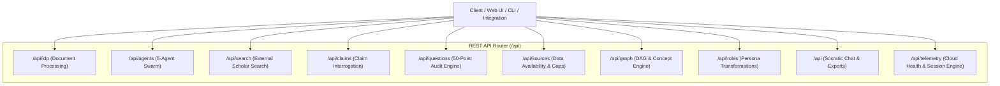
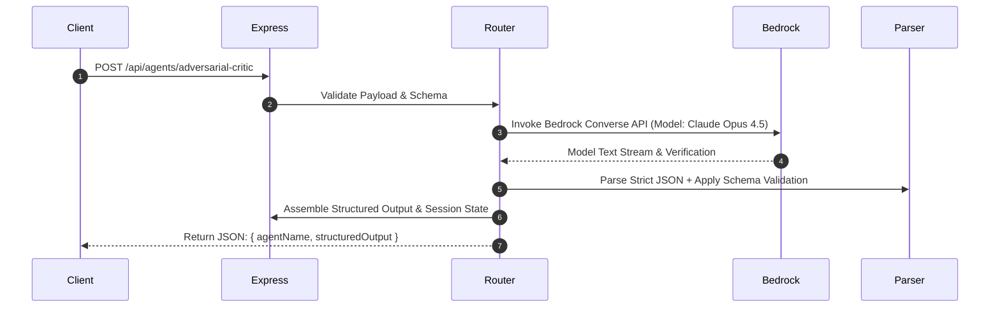
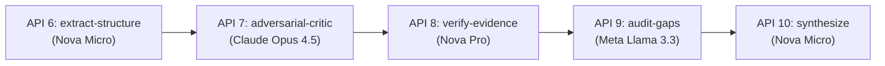
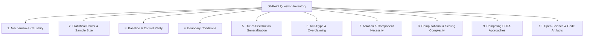
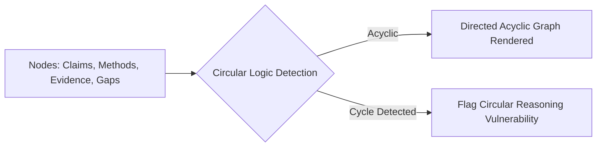

# API Design Specification: 50 Decoupled Micro-Task Endpoints

## 1. Architectural Philosophy: One Task = One API

The **Agentic Research Reviewer** implements a decoupled micro-task REST API architecture. Rather than relying on monolithic endpoints, every discrete operational step—from document linearization and individual claim boundary checks to circular reasoning detection and multi-format report exports—is accessible as an independent, testable endpoint.

---

## 2. Global API Gateway Topology



---

## 3. Request-Response Lifecycle & Pipeline Tracing

Every agentic endpoint captures execution metadata and embeds this directly into the response payload.



---

## 4. Complete 50-Endpoint Specification

```text
┌────────────────────────────────────────────────────────────────────────────────────────┐
│                        THE 50 DECOUPLED MICRO-TASK APIS                                │
├────────────────────────────────────────────────────────────────────────────────────────┤
│ Module 1: IDP & Document Parsing (APIs 1 - 5)   │ Module 6: Data & Gaps (APIs 26-30)   │
│ Module 2: 5-Agent Swarm Layer (APIs 6 - 10)     │ Module 7: Visual Graph (APIs 31-35)  │
│ Module 3: External Search (APIs 11 - 15)        │ Module 8: Role Personas (APIs 36-40) │
│ Module 4: Claim Deep Engine (APIs 16 - 20)      │ Module 9: Chat & Export (APIs 41-45) │
│ Module 5: 50-Question Audit (APIs 21 - 25)      │ Module 10: Health & State (46-50)    │
└────────────────────────────────────────────────────────────────────────────────────────┘
```

---

### Module 1: Document Ingestion & Intelligent Document Processing (IDP)

#### 1. `POST /api/idp/pdf-to-markdown`
Converts raw Base64-encoded PDF to GitHub-Flavored Markdown (.md) and archives to Amazon S3.
* **Request:** `{ "pdfBase64": string, "paperName": string }`
* **Response:**
  ```json
  {
    "paperId": "uuid-v4",
    "markdown": "# Title\n\n## Abstract...",
    "wordCount": 8500,
    "sectionsFound": ["Abstract", "Methodology", "Results", "Discussion"]
  }
  ```

#### 2. `POST /api/idp/extract-tables`
Isolates all Markdown pipe tables from the document stream.
* **Request:** `{ "markdownContent": string }`
* **Response:** `{ "tablesFound": 4, "tables": [{ "id": "t1", "rawTable": "| Col 1 | Col 2 |", "rowCount": 6 }] }`

#### 3. `POST /api/idp/extract-figures`
Extracts image reference tags, captions, and bounding box URIs.
* **Request:** `{ "markdownContent": string }`
* **Response:** `{ "figuresFound": 3, "figures": [{ "caption": "Figure 1: Attention Map", "uriOrPath": "s3://..." }] }`

#### 4. `POST /api/idp/extract-references`
Isolates the bibliography and parses individual citation strings.
* **Request:** `{ "markdownContent": string }`
* **Response:** `{ "referencesFound": 42, "citations": [{ "id": "ref1", "rawCitation": "Vaswani et al. 2017..." }] }`

#### 5. `POST /api/idp/validate-structure`
Validates Markdown header hierarchy, math delimiter balance (`$...$`), and structural completeness.
* **Request:** `{ "markdownContent": string }`
* **Response:** `{ "isValidMarkdown": true, "isMathBalanced": true, "hasAbstract": true, "wordCount": 8500 }`

---

### Module 2: The 5-Agent Swarm Micro-Task Layer



#### 6. `POST /api/agents/extract-structure` (Agent 1: Amazon Nova Micro)
Deconstructs paper into core problem, real-world impact, claims, and baseline datasets.
* **Cost:** $0.035 / 1M input tokens.
* **Response:** `{ "agentName": "Agent 1: Structural Extractor", "structuredOutput": { "claims": [...] }, "telemetry": {...} }`

#### 7. `POST /api/agents/adversarial-critic` (Agent 2: Anthropic Claude Opus 4.5)
Formulates skeptical peer-reviewer challenges, overclaiming checks, and 10-category debate questions.
* **Cost:** $5.00 / 1M input tokens.
* **Response:** `{ "agentName": "Agent 2: Adversarial Critic", "structuredOutput": { "challenges": [...] }, "telemetry": {...} }`

#### 8. `POST /api/agents/verify-evidence` (Agent 3: Amazon Nova Pro)
Cross-checks claims against text and figures; assigns strict `available`, `partially_available`, `not_mentioned` tags.
* **Cost:** $0.80 / 1M input tokens.
* **Response:** `{ "agentName": "Agent 3: Evidence Verifier", "structuredOutput": { "rigorScore": 85, "claimsVerification": [...] }, "telemetry": {...} }`

#### 9. `POST /api/agents/audit-gaps` (Agent 4: Meta Llama 3.3 70B)
Scans citations for paywalls, missing code commits, and unstated limitations.
* **Cost:** $0.72 / 1M input tokens.
* **Response:** `{ "agentName": "Agent 4: Gap Investigator", "structuredOutput": { "missingSources": [...], "unstatedLimitations": [...] }, "telemetry": {...} }`

#### 10. `POST /api/agents/synthesize-deliverables` (Agent 5: Amazon Nova Micro)
Synthesizes role-adapted summaries, concept map graph, and final decision matrix.
* **Cost:** $0.035 / 1M input tokens.
* **Response:** `{ "agentName": "Agent 5: Adaptive Communicator", "structuredOutput": { "finalCompiledAnalysis": {...} }, "telemetry": {...} }`

---

### Module 3: External Search & Scholar Retrieval

* **API 11: `POST /api/search/google-scholar`**: Generates targeted Google Scholar verification URLs for claim replication.
* **API 12: `POST /api/search/arxiv-competing`**: Generates arXiv preprints search queries for competing baseline architectures.
* **API 13: `POST /api/search/pubmed-clinical`**: Generates MeSH and clinical trial query links for biomedical papers.
* **API 14: `POST /api/search/crossref-doi`**: Resolves DOIs and retrieves publication metadata via CrossRef API.
* **API 15: `POST /api/search/openalex-citations`**: Generates OpenAlex citation graph queries to track downstream replication papers.

---

### Module 4: Single-Claim Deep Interrogation & Logic Engine

* **API 16: `POST /api/claims/audit-single`**: Re-evaluates a single specific claim under deeper adversarial constraints.
* **API 17: `POST /api/claims/boundary-conditions`**: Generates IF-THEN validity rules and failure thresholds for a claim.
* **API 18: `POST /api/claims/verification-checklist`**: Evaluates a claim against a 5-point peer-review checklist.
* **API 19: `POST /api/claims/verdict-summary`**: Compiles an audited verdict badge with confidence percentage.
* **API 20: `POST /api/claims/update-status`**: Allows the user to manually override verification status with rationale notes.

---

### Module 5: 50-Question Interrogation Engine



* **API 21: `POST /api/questions/filter-by-category`**: Retrieves adversarial questions filtered by category.
* **API 22: `POST /api/questions/filter-by-status`**: Filters questions by evidence status (`available`, `partially_available`, `not_mentioned`).
* **API 23: `POST /api/questions/generate-custom`**: Generates custom peer-review challenge questions for user-specified sections.
* **API 24: `POST /api/questions/re-evaluate`**: Re-evaluates question answers after supplementary material is uploaded.
* **API 25: `GET /api/questions/category-inventory`**: Returns the complete 10-category taxonomy definition.

---

### Module 6: Data Availability & Missing Sources

* **API 26: `POST /api/sources/list-missing`**: Returns all flagged missing datasets, code repositories, and appendices.
* **API 27: `POST /api/sources/upload-supplementary`**: Ingests supplementary material (PDF, TXT, MD) and recalculates scores.
* **API 28: `POST /api/sources/resolve-gap`**: Manually marks a flagged gap as resolved with user notes.
* **API 29: `POST /api/sources/calculate-transparency`**: Computes the data transparency score (0–100) based on accessible citations.
* **API 30: `POST /api/sources/validate-repo-link`**: Audits GitHub/GitLab repository URLs for branch/commit reproducibility.

---

### Module 7: Visual Concept & Graph Engine



* **API 31: `POST /api/graph/generate-nodes`**: Extracts structural DAG concept nodes with types (`core_claim`, `method`, `evidence`, `gap`).
* **API 32: `POST /api/graph/generate-links`**: Formulates directional causal relationships between concept nodes.
* **API 33: `POST /api/graph/detect-circular-logic`**: Evaluates the graph for circular reasoning or unsubstantiated inference cycles.
* **API 34: `POST /api/graph/export-mermaid`**: Generates live Mermaid diagram syntax string.
* **API 35: `POST /api/graph/export-svg`**: Renders the concept graph as a standalone SVG vector.

---

### Module 8: Role-Adaptive Persona Engine

* **API 36: `GET /api/roles/list`**: Returns definitions for all 8 academic personas (PhD, Graduate Scholar, Undergrad, Reviewer, Journalist, Educator, Practitioner, Evaluator).
* **API 37: `POST /api/roles/transform-overview`**: Rewrites executive summary to match selected persona reading level.
* **API 38: `POST /api/roles/adjust-jargon-level`**: Adjusts vocabulary complexity between CEFR levels (B1 to C2).
* **API 39: `POST /api/roles/suggest-prompts`**: Generates tailored Socratic chat prompt chips for the active persona.
* **API 40: `POST /api/roles/get-focus-areas`**: Returns prioritized evaluation checklist criteria for a specific persona.

---

### Module 9: Socratic Chat & Multi-Format Report Export

* **API 41: `POST /api/chat-paper`**: Multi-turn Socratic peer-reviewer chat powered by Claude Opus 4.5 / Nova Pro.
* **API 42: `POST /api/sample-prompts`**: Generates contextual starter prompts based on paper weaknesses.
* **API 43: `POST /api/export/markdown-report`**: Exports comprehensive critical review report as GitHub Markdown (`.md`).
* **API 44: `POST /api/export/latex-summary`**: Compiles review summary into a LaTeX article snippet (`.tex`).
* **API 45: `POST /api/export/bibtex-citation`**: Generates standard BibTeX citation entry for the paper.

---

### Module 10: Cloud Health & Session State Engine

* **API 46: `GET /api/health`**: Global container and health heartbeat probe.
* **API 47: `GET /api/aws/health`**: Live diagnostic probes testing Amazon S3, DynamoDB, AWS Textract, and Bedrock.
* **API 48: `GET /api/telemetry/pricing`**: Returns supported AWS Bedrock models matrix.
* **API 49: `POST /api/telemetry/session-state`**: Retrieves or updates DynamoDB execution session state.
* **API 50: `GET /api/swarm/stream`**: Server-Sent Events (SSE) stream for real-time agent execution events.

---

## 5. Standard Error Handling Matrix

| HTTP Status | Error Type | Standard Response Structure |
| :--- | :--- | :--- |
| **`400 Bad Request`** | Missing Input / Validation Failure | `{"error": "Paper content or PDF file is required.", "field": "pdfBase64"}` |
| **`404 Not Found`** | Resource / Paper ID Not Found | `{"error": "Session ID not found in DynamoDB table."}` |
| **`429 Too Many Requests`** | AWS Bedrock Throttling | `{"error": "Bedrock rate limit reached. Auto-retrying on secondary model..."}` |
| **`500 Internal Error`** | Upstream Agent Failure | `{"error": "Model invocation failed.", "details": "Error message"}` |
