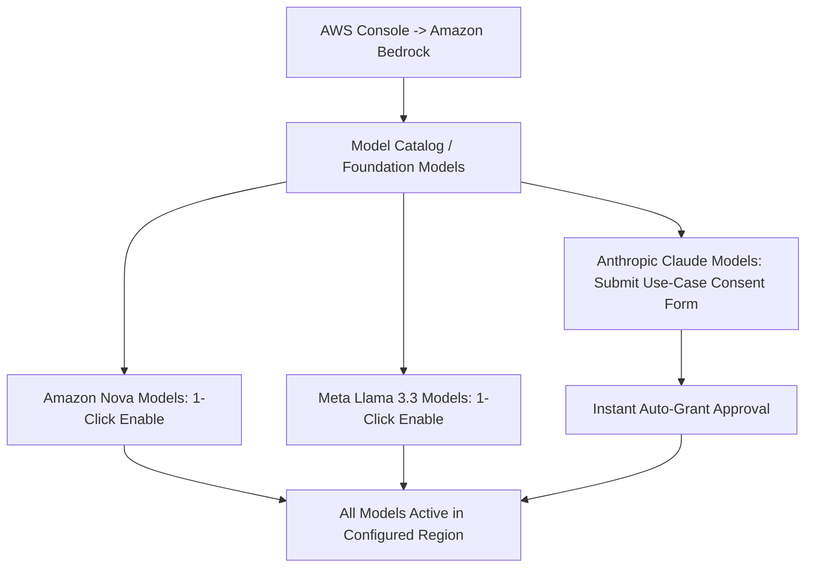

# AWS Setup & Service Provisioning Guide

This step-by-step guide explains how to enable and configure all required Amazon Web Services (AWS) resources, request foundation model access in Amazon Bedrock (including submitting Anthropic's use-case consent form), set up S3 and DynamoDB, generate IAM API credentials, and populate your `.env` configuration.

---

## 📋 Overview of Required AWS Services

| Service | Resource Name / Model ID | Purpose |
| :--- | :--- | :--- |
| **Amazon Bedrock** | `amazon.nova-micro-v1:0`<br/>`amazon.nova-lite-v1:0`<br/>`amazon.nova-pro-v1:0`<br/>`anthropic.claude-opus-4-5-20251101-v1:0`<br/>`meta.llama3-3-70b-instruct-v1:0` | Multi-agent autonomous reasoning, claim extraction, adversarial critique, evidence verification, and persona adaptation. |
| **AWS Textract** | Layout & Tables API | Intelligent Document Processing (IDP) to parse multi-column scientific PDFs into clean Markdown (.md) and pipe tables. |
| **Amazon S3** | `paper-reviewer-storage` (Bucket) | Secure object storage for raw uploaded PDFs, linearized Markdown documents, and cropped figure image assets. |
| **Amazon DynamoDB** | `PaperReviewerSessions` (Table) | Single-table session persistence, multi-agent execution checkpoints, and audit trails. |
| **AWS IAM** | Programmatic User / Role | Identity and Access Management credentials for secure API invocations. |

---

## Step 1: Select Your AWS Region

Select any supported AWS Region where Amazon Bedrock foundation models (Amazon Nova, Anthropic Claude, Meta Llama) are available.

Ensure your AWS Console region dropdown is set to your preferred AWS Region for the steps below.

---

## Step 2: Enable Amazon Bedrock Foundation Models

> 💡 **Console Navigation Note:** In the updated AWS Bedrock Console, model access management is integrated directly into the **Model Catalog** / **Foundation Models** section (previously found under the standalone *Model access* tab in the left sidebar).



### 2.1 Enable Amazon Nova Models
1. Navigate to **Amazon Bedrock** in the AWS Console.
2. In the left navigation pane, select **Model Catalog** (or **Foundation Models**).
3. Select **Amazon** as the provider.
4. Locate **Amazon Nova Micro**, **Amazon Nova Lite**, and **Amazon Nova Pro**.
5. Click **Enable model access** (or **Request access**). Access is typically granted immediately.

### 2.2 Enable Meta Llama Models
1. In the **Model Catalog**, filter by provider **Meta**.
2. Select **Llama 3.3 70B Instruct**.
3. Accept the standard EULA terms and click **Request access** (instant activation).

### 2.3 Submit Anthropic Claude Use-Case Consent Form
Anthropic models (Claude 3.5 Sonnet, Claude Opus 4.5) require submitting a brief organization/use-case registration form prior to activation:

1. In the **Model Catalog**, filter by provider **Anthropic**.
2. Select **Claude 3.5 Sonnet** or **Claude Opus 4.5**.
3. Click **Request model access** (or **Modify access**).
4. An **Anthropic Use Case Details** form will appear. Complete the required fields:
   * **Company / Organization Name:** Enter your university name, lab, company, or personal developer name.
   * **Company Website URL:** Enter your personal website, GitHub profile URL (`https://github.com/your-username`), or organization domain.
   * **Primary Industry:** Select *Education*, *Technology*, or *Research*.
   * **Intended Use Case Description:** Provide a short descriptive sentence, for example:
     > *"Academic research paper deconstruction, adversarial claim verification, and educational literature summarization."*
5. Click **Submit**. Anthropic model access is automatically verified and granted within moments.
6. Verify that the access status displays as **Access granted** (green checkmark).

---

## Step 3: Create Amazon S3 Storage Bucket

1. Open the **Amazon S3 Console** at [https://console.aws.amazon.com/s3/](https://console.aws.amazon.com/s3/).
2. Click **Create bucket**.
3. Configure the bucket parameters:
   * **Bucket name:** `paper-reviewer-storage` *(Note: If this globally unique name is taken in your account pool, choose a custom name such as `paper-reviewer-storage-yourname` and update `.env` accordingly).*
   * **AWS Region:** Select your configured AWS Region (same as Bedrock).
   * **Object Ownership:** *ACLs disabled (recommended)*.
   * **Block Public Access settings:** Keep **Block all public access** checked (access is secured via IAM credentials and presigned URLs).
   * **Bucket Versioning:** Optional / Disabled.
   * **Default encryption:** *Server-side encryption with Amazon S3 managed keys (SSE-S3)*.
4. Click **Create bucket**.

---

## Step 4: Create Amazon DynamoDB Table

1. Open the **Amazon DynamoDB Console** at [https://console.aws.amazon.com/dynamodb/](https://console.aws.amazon.com/dynamodb/).
2. Click **Create table**.
3. Configure the table parameters:
   * **Table name:** `PaperReviewerSessions`
   * **Partition key:** `sessionId` (Data Type: **String**)
   * **Sort key:** Leave blank.
   * **Table settings:** Select **Default settings** (or customize to **On-demand** capacity mode for pay-per-request pricing).
4. Click **Create table**. The table will become `ACTIVE` within 5 seconds.

---

## Step 5: Create IAM User & Generate API Access Keys

To allow the Node.js / Express application to authenticate with AWS Bedrock, S3, DynamoDB, and Textract:

1. Open the **AWS IAM Console** at [https://console.aws.amazon.com/iam/](https://console.aws.amazon.com/iam/).
2. In the left menu, select **Users** -> Click **Create user**.
3. **User name:** `paper-reviewer-agent` -> Click **Next**.
4. In the **Set permissions** step, select **Attach policies directly**.
5. Search and check the following managed policies:
   * `AmazonBedrockFullAccess`
   * `AmazonS3FullAccess` *(or create an inline policy scoped to your bucket)*
   * `AmazonDynamoDBFullAccess` *(or scoped to `PaperReviewerSessions`)*
   * `AmazonTextractFullAccess`
6. Click **Next** -> Click **Create user**.

### Generate Access Keys:
1. Click on the newly created user `paper-reviewer-agent`.
2. Navigate to the **Security credentials** tab.
3. Scroll down to **Access keys** -> Click **Create access key**.
4. Select **Application running outside AWS** -> Click **Next**.
5. (Optional) Enter a tag such as `Paper Reviewer Local Dev` -> Click **Create access key**.
6. **Copy and save** your **Access key ID** and **Secret access key** (or download the `.csv` file).

---

## Step 6: Configure Local `.env` File

1. In the project root directory, copy the example template:
   ```bash
   cp .env.example .env
   ```

2. Open `.env` and paste your credentials:
   ```env
   # ==========================================
   # AMAZON WEB SERVICES (AWS) CONFIGURATION
   # ==========================================
   AWS_REGION="YOUR_AWS_REGION"
   AWS_ACCESS_KEY_ID="YOUR_AWS_ACCESS_KEY_ID"
   AWS_SECRET_ACCESS_KEY="YOUR_AWS_SECRET_ACCESS_KEY"

   # Amazon S3 Bucket for PDF Papers & Extracted Figures
   S3_BUCKET_NAME="paper-reviewer-storage"

   # Amazon DynamoDB Table for Session Checkpoints & State
   DYNAMODB_TABLE_NAME="PaperReviewerSessions"
   ```

> 🔒 **Security Best Practice:** `.env` is automatically ignored in `.gitignore`. Never commit `.env` or hardcoded credentials to any public or private repository.

---

## Step 7: Automated Cloud Connectivity Verification

Verify that all four AWS services (S3, DynamoDB, Textract, Bedrock) are functioning correctly by running the diagnostic test suite:

```bash
npm run test:aws
```

### Expected Output:
```text
═══════════════════════════════════════════════════════════════════════
  THE AGENTIC RESEARCH REVIEWER — AWS SERVICES CONNECTIVITY DIAGNOSTIC 
═══════════════════════════════════════════════════════════════════════

Environment Configuration:
  • AWS Region:             YOUR_AWS_REGION
  • AWS Credentials Source: Custom (.env: AWS_ACCESS_KEY_ID / SECRET)
  • S3 Bucket Configured:   paper-reviewer-storage
  • DynamoDB Table:         PaperReviewerSessions

  [1/4] Probing Amazon S3 (Bucket & Storage API)... ✔ PASS
  [2/4] Probing Amazon DynamoDB (State & Checkpoints)... ✔ PASS
  [3/4] Probing AWS Textract (Layout & Tables IDP)... ✔ PASS
  [4/4] Probing Amazon Bedrock (Multi-Agent Converse API)... ✔ PASS

───────────────────────────────────────────────────────────────────────
Final Status: 4 Passed, 0 Warnings, 0 Failed
═══════════════════════════════════════════════════════════════════════
```

---

## Step 8: Start the Application

Once `npm run test:aws` passes with 4/4 services verified:

```bash
npm run dev
```

Open **[http://localhost:3000](http://localhost:3000)** in your browser to start reviewing research papers with your AWS multi-agent swarm.
